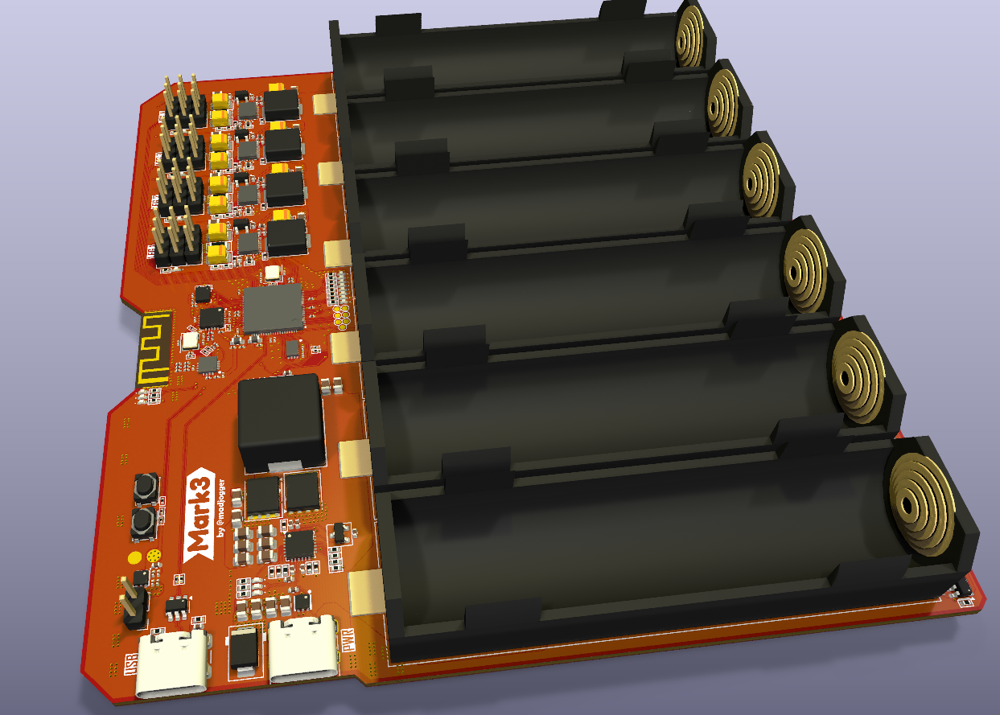
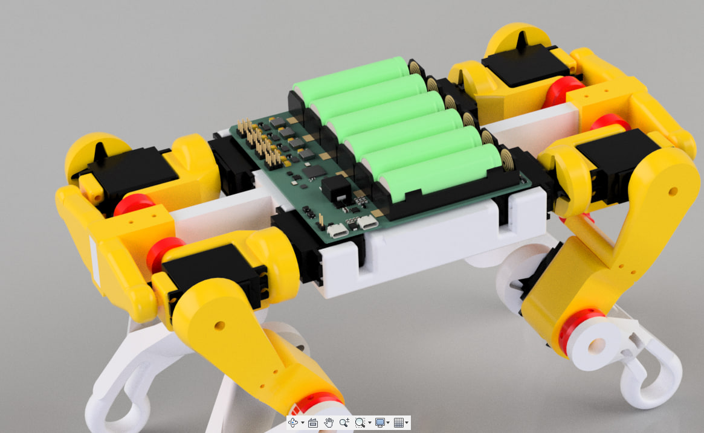

# Mark 3 — Robot Dog Control Board

> High-current RP2350B-based controller board for quadruped robots.  
> Integrated **battery protection**, **PD charging**, **per-leg power domains**, and **radio/IMU** subsystem.  
> Designed for compact 4-legged robots with modular legs and high servo load.

---

## What’s on the board
- **Main MCU:** RP2350B (USB-programmable)
- **Power system:**
  - **6 × 18650** cells in **parallel** (on-board holders)
  - **Protection IC:** DW01 for undervoltage / overcurrent safety  
  - **USB Type-C PD** charging via **HUSB237-AA001-DN06R** (default 15 V profile, configurable)
  - **Battery charger:** BQ24610, up to **10 A charge current**
  - **Four TPS61088** boost converters — each provides **6 V / 10 A** per leg
  - Individual **enable lines** for each leg’s converter
  - **Current-sense** circuit per leg power rail
- **IMU:** LSM6DS3 (SPI interface)
- **Radio:** nRF24L01P (integrated 2.4 GHz transceiver)
- **LED indication:**
  - 8 × battery-level LEDs
  - 2 × status LEDs (power / charging / fault)
- **Two separate USB-C ports:**
  - **Programming** (direct to RP2350B)
  - **Charging** (PD trigger + BQ24610)
- **BOOT** button for UF2 flashing  
- All power and signal routing optimized for servo current spikes

---

## Power System Overview
| Function | Component | Voltage | Current | Notes |
|:--|:--|:--|:--|:--|
| PD Trigger | HUSB237-AA001-DN06R | 15 V (default) | up to 3 A | Configurable by resistors |
| Charger | BQ24610 | 15 V → Battery | up to 10 A | 1S6P Li-ion |
| Protection | DW01 | 1S | — | Undervoltage / overcurrent cutoff |
| Boost × 4 | TPS61088 | 6 V | 10 A each | One per leg |
| MCU & Logic | RP2350B + LDO | 3.3 V | — | Isolated domain |

> ⚠️ **Do not** connect external 5 V to the MCU port while PD charging.  
> Power and data paths are separate to prevent back-feed.

---

## Sensors & Interfaces
- **LSM6DS3 (SPI)** — motion sensing (accelerometer + gyroscope)  
- **nRF24L01P (SPI)** — wireless communication  
- Expansion headers for extra sensors (I²C / SPI / UART)  
- Servo outputs grouped per leg (3 per leg × 4 legs)

---

## Battery Section
- 6 × **18650 cells in parallel**
- **DW01** provides basic protection (no balancing)
- On-board holders for easy replacement
- **LED bar (8 segments)** for charge level indication

---

## Quick Use
1. Insert 6× 18650 cells into holders.  
2. Connect USB-C **charging** port (PD trigger negotiates 15 V).  
3. Wait for charge LEDs to show full battery.  
4. Connect USB-C **programming** port to PC.  
5. Hold **BOOT** and power the board to enter UF2 mode.  
6. Flash firmware to RP2350B.  
7. Control each leg’s power domain and read current measurements as needed.

---

## Typical Applications
- Quadruped robots (up to 4 legs, 3 servos per leg)
- High-current servo testing rigs
- Portable motion control platforms
- Development base for RP2350 motion control firmware

---

## Notes
- Each leg’s 6 V converter (TPS61088) can be disabled via GPIO.  
- Charging and MCU USB ports are independent.  
- PD trigger default = 15 V (can be changed by resistor network).  
- Full pinout and schematics in `/docs/Mark3_schematic.pdf`.

---
